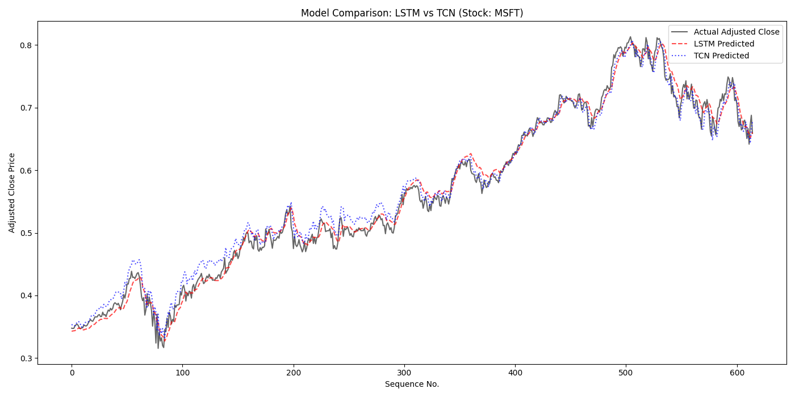

# S&P 500 Technology Stock Forecasting with LSTM and TCN
This project builds and compares two deep learning models — an **LSTM** and a **Temporal Convolutional Network (TCN)** with stock embeddings — to forecast **next-day adjusted close prices** for S&P 500 technology-sector stocks using both market data and macroeconomic indicators.

The pipeline includes:
- Dataset merging and cleaning
- Sequence generation for multiple stocks
- LSTM and TCN model architectures in PyTorch
- Hyperparameter tuning via grid search
- Visual analysis of tuning results
- Interactive per-stock prediction visualization

---
# Dataset
This notebook uses clean and merged dataset including the following:

- S&P 500 companies list
- S&P 500 daily stock trading data
- A macroeconomic indicators dataset (interpolated to daily frequency)

The goal is to produce a unified dataset of technology-sector stock prices enriched with macroeconomic variables for downstream modeling. This repository includes the fully cleaned and merged dataset (`sp500_stocks_with_macro_clean.csv`) along with notebook used to merge datasets.

Dataset can be found from kaggle as indicated:
1. S&P 500 Daily Stock Market Data
Source: https://www.kaggle.com/datasets/andrewmvd/sp-500-stocks
Contains daily OHLCV data for all S&P 500 companies and company metadata.

2. Macroeconomic Indicators Dataset
Source: https://www.kaggle.com/datasets/sagarvarandekar/macroeconomic-factors-affecting-us-housing-prices
Contains indicators such as unemployment rate, CPI, consumer confidence index, PPI, inflation, mortgage rates, GDP metrics, and more.

---
# Data Preparation
This project begins by loading the cleaned dataset (sp500_stocks_with_macro_clean.csv), which contains daily price and macroeconomic features for technology-sector S&P 500 stocks. The preparation pipeline includes the following steps:

- Load and sort the dataset by `Symbol` and `Date` to ensure sequences are in chronological order.
- Select the 20 modeling features, including:
  - Price-related features (Adj Close, Close, High, Low, Open, Volume)
  - Macroeconomic variables such as unemployment rate, CPI, inflation, mortgage rates, consumer confidence, GDP indicators, and housing market metrics.
- Normalize all features using MinMaxScaler to scale values between 0 and 1. This ensures stable training for both LSTM and TCN models.
- Create a consistent index for each stock symbol. This index is later used by the TCN model to incorporate stock identity via an embedding layer.
- Generate sequences for time series forecasting. Each training sample consists of:
  - An input sequence of 30 consecutive days (shape: 30 × 20 features)
  - A target value representing the next day’s normalized adjusted close price
- Build two types of sequence datasets:
  - LSTM sequences for each stock independently
  - TCN sequences that include both the feature sequence and a stock index
- Split each stock’s sequences into training and testing sets using an 80/20 ratio.
- Create PyTorch DataLoaders for efficient batching and training.
  -LSTM uses a separate DataLoader per stock
  -TCN uses both per-stock loaders and a combined “global” loader so the model can learn patterns across all stocks simultaneously

---
# Model Architecture
This project compares two deep learning architectures for next-day adjusted close price prediction: an LSTM-based sequence model and a Temporal Convolutional Network (TCN) with stock embeddings.  

**LSTM**  
The LSTM model treats each stock independently and learns temporal patterns from a fixed-length window of past prices and macroeconomic features.  
Input:
- Shape: (batch_size, sequence_length, num_features)  

Architecture:  
One or more LSTM layers with configurable:
- hidden_size (number of units in the LSTM)
- num_layers (stacked LSTM depth)
- Optional LSTM dropout when more than one layer is used, to reduce overfitting
- A fully connected (Linear) layer maps the final hidden state to a single output value  

Output:  
- A single scalar per sample representing the next-day normalized adjusted close price  

**TCN**  
The TCN model is designed to learn from all stocks jointly, while still distinguishing between individual stocks via learned embeddings.  

Stock embeddings:
- Each stock symbol is mapped to a learnable embedding vector using nn.Embedding  
- The embedding is expanded across the time dimension and concatenated to the feature sequence

This allows the model to share temporal patterns across stocks while encoding stock identity  

Input:
- Feature sequence of shape (batch_size, sequence_length, num_features)
- Stock index tensor of shape (batch_size,) indicating which stock each sequence belongs to
- Residual dilated convolution blocks:
  - Multiple ResidualBlock1D layers stacked with increasing dilation factors (e.g., 1, 2, 4, …)
  - Each block includes:
    - 1D convolution with dilation (to capture longer-range temporal dependencies)
    - ReLU activation
    - Dropout for regularization
    - Residual connection (with projection if needed) to stabilize training and enable deeper networks  

Output:  
- After the convolutional stack, the model takes the final time step’s representation and passes it through a Linear layer to produce a single scalar prediction for the next-day normalized adjusted close price

---
# Training & Evaluation
Both the LSTM and TCN models were trained using a consistent training pipeline designed to ensure fair comparison and stable convergence.

## Training Configuration 
- Loss function: Mean Squared Error (MSE)
- Optimizer: Adagrad
- Early stopping:
  - Triggered when validation loss stops improving for several epochs
  - Helps prevent overfitting and reduces unnecessary training
- Epochs:
  - Maximum of 200 epochs
  - Realistically, stops earlier due to early stopping
- Batch size: 16, across all experiments
- Train/test split:
  - Each stock’s sequences split with 80% for training and 20% for testing

## LSTM Training
- Each stock is trained using its own DataLoader
- The model learns temporal patterns independently for each stock
- After each epoch:
  - Compute training and validation MSE
  - Compute RMSE, MAPE, and R²
- Best-performing weights (based on validation loss) are saved and restored at the end

## TCN Training
- Uses a combined global DataLoader so the model can learn jointly from all stocks
- Stock identity is provided through the embedding index
- Same evaluation metrics as LSTM:
  - RMSE, MAPE, R²
- Early stopping is applied in the same way
- Final weights from the best-performing epoch are saved for later use

---
# Hyperparameter Tuning
To improve performance beyond baseline models, an extensive grid search was conducted for both the LSTM and TCN architectures. Each configuration was trained with early stopping, evaluated using RMSE, MAPE, and R², and the results were logged for further analysis.

## LSTM Hyperparameter Search
A grid search was performed over the following parameters:
- Hidden size: 50, 100, 150, 200
- Number of LSTM layers: 1, 2
- Learning rate: 0.01, 0.005, 0.001  

For each combination:
- The model was trained using the same training pipeline as the baseline
- Best epoch weights (based on validation loss) were saved
- RMSE, MAPE, R², and validation loss were recorded
- Results were saved to `lstm_grid_search_results.csv`

## TCN Hyperparameter Search
A similar grid search was conducted for the TCN model using:
- Kernel size: 2, 3, 4
- Hidden channel size: 32, 64, 128
- Number of convolutional layers: 2, 3, 4  

For each configuration:
- The TCN was trained on the combined global dataset
- Early stopping was applied to prevent overfitting
- Prediction metrics were logged in the same manner as LSTM tuning
- Results were saved to `tcn_grid_search_results.csv`

## Visualization of Tuning Results
To help interpret the grid search results, heatmaps were generated for each model:
- For LSTM: RMSE by hidden size and learning rate (separated by number of layers)
- For TCN: RMSE by kernel size and hidden channel count (separated by number of layers)

These heatmaps:
- Highlight performance patterns across hyperparameters
- Make it easy to identify stable and optimal regions
- Display the best-performing configuration, outlined in each plot

The generated heatmaps are saved as:
- `LSTM_Tuning.png`
- `TCN_Tuning.png`

--- 
# Final Results and Model Comparison
After hyperparameter tuning, the best-performing configurations for both the LSTM and TCN models were identified and evaluated. The TCN with stock embeddings consistently outperformed the LSTM baseline across all evaluation metrics.

## Best LSTM Model
- Hidden size: 50
- Number of layers: 1
- Learning rate: 0.001
- Training epochs: 200
- Validation RMSE: 0.01462
- MAPE: 0.074388
- R²: 0.995287
- Best validation loss: 0.000214  

The LSTM performed well overall, especially given that each stock is trained independently. It captures short-term temporal trends but is less effective at modeling cross-stock relationships and long-range dependencies.

## Best TCN Model
- Kernel size: 2
- Hidden channels: 32
- Number of layers: 3
- Training epochs: 200
- Validation RMSE: 0.012306
- MAPE: 0.053484
- R²: 0.996660
- Best validation loss: 0.000151
The TCN achieved lower RMSE, lower MAPE, and higher R² compared to the LSTM. This indicates better forecasting accuracy and greater ability to explain variation in stock price movements.

## Final Conclusions
Overall, the results show that the TCN with stock embeddings provides a more accurate and robust approach to next-day price forecasting than the LSTM baseline. While the LSTM performs well on individual stocks, the TCN benefits from learning across the entire technology sector and leveraging dilated convolutions to capture longer-range temporal patterns. The addition of stock embeddings further improves its ability to differentiate between assets while sharing common structure. Together, these advantages allow the TCN to achieve lower error, better generalization, and stronger predictive performance, making it the preferred model for multi-stock forecasting in this project.

